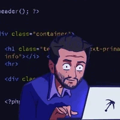

# Hi there, I'm Denys 

###  About me:

I'm a student and an aspiring front-end developer  from Ukraine. I've always been enthusiastic about development and computer science.

	

- 🔭 I’m working on different projects.
- 🌱 I’m currently in process of learning Typescript and English.
- ⚡ In my free time I do workout, go for a walk, read tech and business articles.
- 📫 How to reach me: &nbsp; 

###  Technologies:

---

###  Tools:

---

###  Keep in touch:

